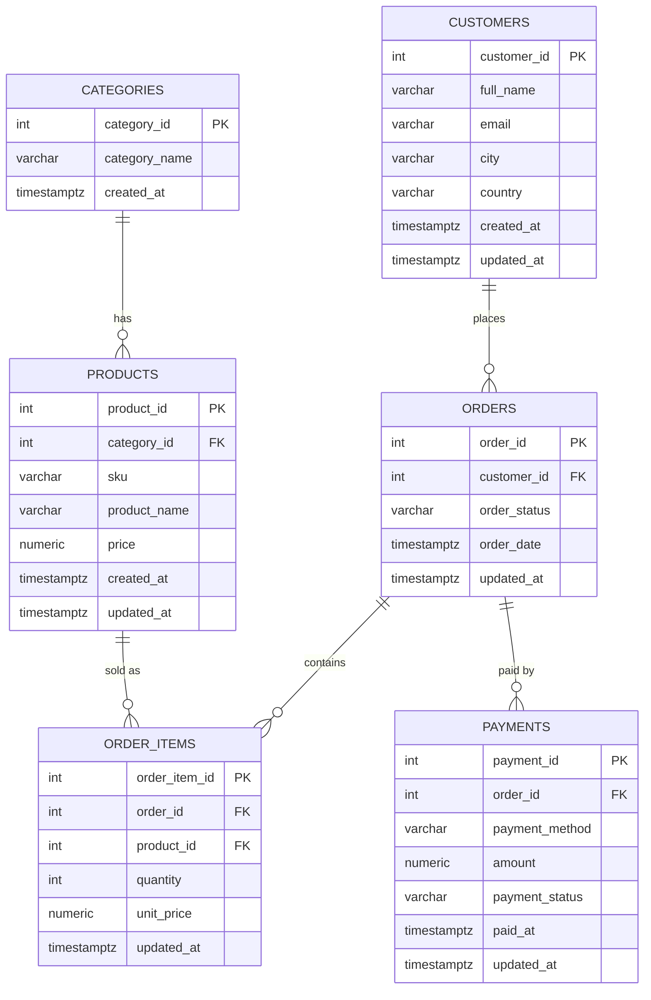

# Project Requirements — U1T01: Real-Time Analytics with PostgreSQL CDC & ClickHouse

This document is the single source of truth for decisions that affect more than one
person's part. Read [handoffs.md](handoffs.md) for your specific numbered instructions —
this file explains *why* those instructions look the way they do.

## 1. Goal (from the assignment)

Implement CDC from PostgreSQL (OLTP) to ClickHouse (OLAP) using PeerDB, feed it with a
continuous data generator, then benchmark identical analytical queries on both engines
and explain the differences. Optional real-time dashboard on top of ClickHouse.

Deliverables: a repo that runs with **one `docker compose up`**, plus a PDF report
(ER model, CDC implementation notes, benchmark results).

## 2. Domain decision: E-commerce

Chosen over rideshare/telemetry because it produces a natural mix of INSERT (new
orders), UPDATE (status transitions — this is what makes CDC visually interesting),
and DELETE (cancelled/removed items) operations, and the analytical questions
(revenue by category, top products, AOV, order funnel) are easy to write and to
explain in the report. **If your team would rather do rideshare or telemetry, the same
structure applies — swap table names, keep the shape (3NF, ~6 tables, every table has
`updated_at`).**

## 3. Schema (3NF) — the shared contract



### Design notes (why it's 3NF)

- `order_items.unit_price` is a **snapshot** of the product's price at purchase time —
  this is not a normalization violation, it's a fact that cannot be derived later
  (product price changes over time; the order must remember what was actually charged).
- Every mutable table carries `updated_at`. This is required by Part 3: ClickHouse
  will use `ReplacingMergeTree(updated_at)` to resolve out-of-order CDC updates, and
  reads must use `FINAL` (or `ORDER BY updated_at DESC LIMIT 1 BY id`) to see the
  latest version of a row.
- `order_status` transitions: `pending → paid → shipped → delivered`, or
  `pending → cancelled`. `payment_status`: `pending → completed`, or
  `pending → failed → refunded`. The generator drives these transitions via UPDATE.
- DELETEs must actually happen (not just be simulated as status changes) so the CDC
  delete path gets exercised — e.g. deleting an `order_items` row before checkout, or
  deleting a stale unpaid `payments` row. **How PeerDB propagates deletes into
  ClickHouse (soft-delete column vs hard row delete) is not something to assume —
  Part 2/3 owners must check the current PeerDB docs for this and document what they
  found**, don't guess.

## 4. Architecture

```
                 ┌─────────────┐        ┌─────────┐        ┌────────────┐
generator.py ───▶│  PostgreSQL │──CDC──▶│  PeerDB │──────▶│ ClickHouse │◀── dashboard
 (Part 1)        │  (Part 1)   │        │ (Part 2)│        │  (Part 3)  │    (Part 5)
                 └─────────────┘        └─────────┘        └────────────┘
                                                                   ▲
                                              benchmark queries ───┘ (Part 4, hits both DBs)
```

All of this lives under **one root `docker-compose.yml`**. Each part adds its own
service block(s) and does not touch another part's service block without asking.

## 5. Shared contract values (do not rename without updating this file)

| Thing | Value |
|---|---|
| Postgres service name | `postgres` |
| Postgres db name | `ecommerce` |
| Postgres port | `5432` |
| Superuser | `postgres` / `${POSTGRES_PASSWORD}` |
| Replication role | `replicator` / `${REPLICATOR_PASSWORD}`, `LOGIN REPLICATION` |
| Publication name | `peerdb_pub` (covers all 6 tables) |
| ClickHouse service name | `clickhouse` |
| ClickHouse db name | `ecommerce` |
| ClickHouse HTTP port | `8123`, native port `9000` |
| Generator service name | `generator` |
| Dashboard service name | `dashboard` |
| Env file | root `.env` (from `.env.example`, never commit real `.env`) |

## 6. Non-functional requirements

- `docker compose up --build` from repo root must bring up every container healthy
  with **no manual UI clicking required** for the core pipeline to start flowing data.
  If creating the PeerDB mirror can't be done purely via compose health-checks +
  dependency ordering, it must be a script committed to the repo
  (`peerdb/setup_mirror.sh` or similar) that a wait-for-healthy init step runs
  automatically — not a step described only in a README that a grader has to run by hand.
- At least ~200,000 total INSERT/UPDATE/DELETE operations across the run (per the
  assignment). The generator should be tunable (rate, duration) via env vars.
- Report is a PDF containing: ER diagram, CDC setup steps/considerations, and the
  Part 4 benchmark comparison (execution times, plans, explanation of differences).

## 7. Team → Part mapping

See [handoffs.md](handoffs.md) for the full breakdown. Summary:

| Part | Owner | Why |
|---|---|---|
| 1 — Relational modeling & data generator | Julio | strong technical / normalization work |
| 2 — CDC pipeline (PeerDB) | Valeria | pairs with Jose Angel — CDC output is his input |
| 3 — ClickHouse analytical layer | Jose Angel | pairs with Valeria, sequential dependency |
| 4 — Benchmarking | Leonora | independent, needs Parts 1–3 done |
| 5 — Real-time dashboard | Lorena | visualization specialist |
